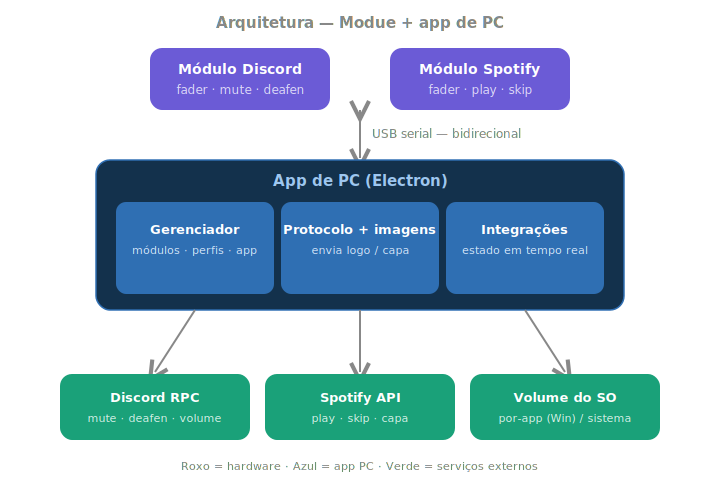

# Modue — Mixer Modular Magnético

Controlador físico modular para PC que controla individualmente o volume de aplicações (Discord, Spotify, Chrome, jogos…) através de módulos magnéticos, cada um com display touch e fader motorizado, comunicando via Bluetooth Low Energy.

> Inspirado em produtos como Monogram Creative Console e Intech Studio Grid, porém open-source, modular e a uma fração do custo.

## Arquitetura

O firmware é um renderizador genérico **controlado pelo app de PC**: o módulo recebe comandos (volume, estado, cor, imagens) e devolve eventos de toque. Detalhes em [`docs/architecture.md`](docs/architecture.md) e o contrato em [`PROTOCOL.md`](PROTOCOL.md).

## Hardware

- **MCU + Display:** ESP32-C6-Touch-LCD-1.47 (SpotPear/Waveshare) — display **JD9853** 172×320 + touch **AXS5106L**
- **Fader motorizado:** ALPS RS60N11M9A0
- **Driver de motor:** DRV8833 / TB6612FNG
- **Conexão entre módulos:** pogo pins magnéticos (energia) + BLE (dados)

## Pinagem (placa Touch — JD9853)

| Display | GPIO | | Touch | GPIO |
|---|---|---|---|---|
| SCK | 1 | | SDA | 18 |
| MOSI | 2 | | SCL | 19 |
| DC | 15 | | RST | 20 |
| CS | 14 | | INT | 21 |
| RST | 22 | | | |
| BL | 23 | | | |

> ⚠️ É a variante **Touch** (JD9853, não ST7789). O JD9853 precisa de sequência de init própria — ver `modue/`.

## Firmware (Arduino IDE)

| Sketch | Descrição |
|---|---|
| `modue/` | **Firmware principal** — renderizador dinâmico controlado pelo PC (LVGL) |
| `discordUI/` | UI do módulo em LVGL com tela Discord fixa (histórico) |
| `displayHello/` | Teste do display JD9853 + fader touch (Arduino_GFX) |

**Libs:** GFX Library for Arduino, LVGL 8.4, esp_lcd_touch_axs5106l
**Board:** ESP32C6 Dev Module · USB CDC On Boot: Enabled

## App de PC

Em `app/` (Node/Electron). Lê os eventos do módulo e aplica nos serviços (Discord, Spotify, volume). Veja [`app/README.md`](app/README.md) e o [`PROTOCOL.md`](PROTOCOL.md).

## Roadmap

- [x] Display JD9853 + touch AXS5106L
- [x] UI em LVGL (logo, fader, botões mute)
- [x] Ícones/logo reais no display
- [x] Protocolo bidirecional + firmware dinâmico (Fase A)
- [ ] Envio de imagem pro display (Fase B)
- [ ] Shell do app Electron (Fase C)
- [ ] Discord RPC nativo + estado de volta (Fase D)
- [ ] Spotify — play/skip + capa do álbum (Fase E)
- [ ] Multi-módulo + perfis (Fase F)
- [ ] Fader motorizado + BLE

Documentação completa em [`claude.md`](claude.md).
